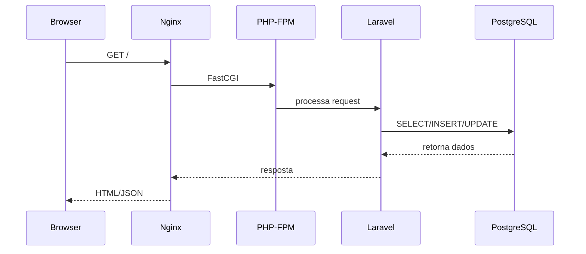

# 📄 **README.md — Arquitetura Oficial SH3-SIAP (Laravel Sail + Docker + Multi-Tenant + Modular)**

````md
# SH3-SIAP — Arquitetura Moderna com Laravel Sail, Docker, Multi-Tenant e Módulos

Este repositório contém a arquitetura oficial do **SH3-SIAP**, um sistema modular e multi-tenant para gestão pública municipal.  
A stack foi modernizada utilizando **Laravel 12**, **Docker + Laravel Sail**, **PostgreSQL Multi-Tenant por Schemas**, **Vue 3 + Inertia**, e um ecossistema modular baseado no **Laravel Modules (Nwidart)**.

---

## 🚀 Visão Geral

A arquitetura foi projetada para ser:

- **Escalável**
- **Isolada**
- **Modular**
- **Padronizada**
- **Segura**
- **Preparada para SaaS**

Cada parte do sistema foi desenvolvida com foco em manter isolamento entre municípios/autarquias, padronização do ambiente e desenvolvimento mais rápido.

---

# 🧱 Tecnologias Principais

| Camada | Tecnologia |
|--------|------------|
| Backend | Laravel 12 + PHP-FPM 8.4 |
| Frontend | Vue 3 + Inertia + Vite |
| Banco de Dados | PostgreSQL 18 |
| Ambiente | Docker + Laravel Sail |
| Cache / Sessions | Redis (opcional) |
| Arquitetura | Módulos (Nwidart) |
| Multi-Tenant | PostgreSQL Schemas com Search Path |
| Autenticação | Sanctum + Tokens + Modo Suporte |

---

# 🐳 Ambiente Docker com Laravel Sail

O ambiente de desenvolvimento utiliza **Laravel Sail**, garantindo:

- Mesma stack para todos os desenvolvedores  
- Zero configuração no host  
- Containers para PHP, Nginx, Node, Postgres e Redis  
- Fluxo padronizado de comandos  
- Hot Reload com Vite (porta 5173)

### Iniciando o ambiente

```bash
docker compose up -d
./vendor/bin/sail composer install
./vendor/bin/sail npm install
./vendor/bin/sail artisan key:generate
````

### Acessando o container

```bash
docker exec -it laravel.test bash
```

### Rodando o Vite

```bash
./vendor/bin/sail npm run dev
```

---

# 🏗 Arquitetura Modular (Laravel Modules)

O sistema é composto por módulos independentes:

```
Modules/
 ├── AuthCore/
 ├── ClientCore/
 ├── Frota/
 ├── Patrimonio/
 ├── Tesouraria/
 ├── Orçamento/
 └── ...
```

Cada módulo possui:

* Controllers
* Models
* Services
* Migrations
* Rotas
* Configurações

### Criar um módulo

```bash
./vendor/bin/sail artisan module:make Frota
```

### Executar migrations do módulo

```bash
./vendor/bin/sail artisan module:migrate Frota
```

---

# 🏛 Multi-Tenant por Schemas PostgreSQL

O banco segue arquitetura **schema-based**, onde cada município/autarquia possui seu próprio schema.

Exemplo:

```
common
santa_cruz.prefeitura
santa_cruz.camara
tiradentes.prefeitura
```

O Laravel troca o schema dinamicamente por request usando:

* `SetClientSchema` (Middleware)
* `SchemaManager` (Service)
* Tokens e contexto ativo

### Benefícios

✔ Isolamento total de dados
✔ Seguro por padrão
✔ Escalável para múltiplos municípios
✔ Fácil auditoria e backup
✔ Não aumenta complexidade de queries

---

# 🔐 Autenticação + Contexto + Modo Suporte

O fluxo inclui:

* Login
* Token principal
* Token de suporte
* Troca de autarquia
* Aplicação dinâmica do schema correto

### Segurança

* Cada conexão recebe o `search_path` correto
* Modo suporte funciona dentro do schema selecionado
* Zero risco de acessar dados indevidos

---

# 🔄 Fluxo de Requisição



---

# 📁 Estrutura Geral do Projeto

```
/var/www/html
 ├── app/
 ├── bootstrap/
 ├── config/
 ├── database/
 ├── Modules/
 ├── public/
 ├── resources/
 ├── routes/
 ├── storage/
 ├── tests/
 ├── composer.json
 └── vite.config.js
```

---

# 🧪 Comandos Úteis

### Artisan

```bash
./vendor/bin/sail artisan route:list
./vendor/bin/sail artisan migrate
./vendor/bin/sail artisan test
```

### NPM/Vite

```bash
./vendor/bin/sail npm run dev
./vendor/bin/sail npm run build
```

### Banco de Dados

```bash
docker exec -it pgsql psql -U sail -d laravel
```

---

# 🎯 Benefícios da Arquitetura

## ✔ Técnicos

* Ambientes idênticos
* Deploy simplificado
* Multi-tenant real por schema
* Evolução modular
* Melhor organização do código

## ✔ Estratégicos

* Preparado para SaaS
* Crescimento ilimitado por módulos
* Fácil onboarding de novos devs
* Redução drástica de falhas

## ✔ Operacionais

* Logs centralizados
* Modo suporte seguro
* Menos impacto entre municípios

---

# 📘 Documentação Complementar

A documentação completa está em:

```
/docs/infra/
```

Incluindo:

* Docker + Sail
* Arquitetura
* Multi-Tenant
* Flow Diagrams
* Modo Suporte
* Modularização
* Guia de Desenvolvimento

---

# 🏁 Licença

Software proprietário — SH3 Sistemas.

---

Se quiser gerar este README em PDF, HTML estilizado ou como página da Wiki do GitHub, posso gerar automaticamente.

```

---

