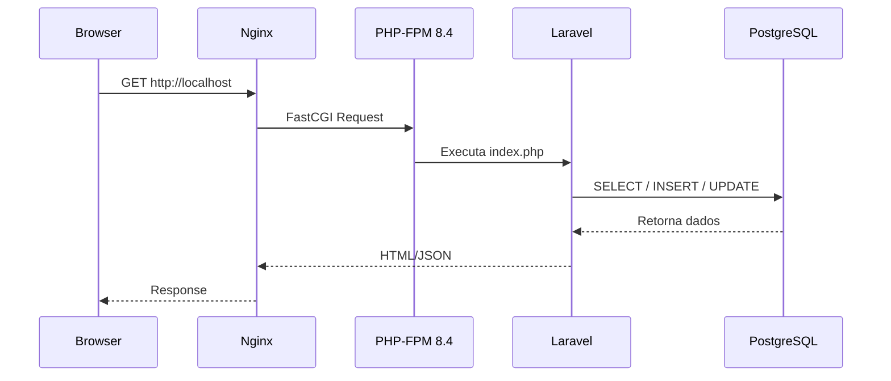

# Arquitetura do Sistema usando Laravel Sail

Este documento descreve a arquitetura oficial da aplicação SIAP quando executada em ambiente Docker com Laravel Sail.

---

# 🌐 Fluxo da Requisição



---

# 🧱 Camadas da Arquitetura

### ✔ 1. Frontend
- Browser → Vue 3 → Inertia → Vite HMR

### ✔ 2. Backend (Container laravel.test)
- Nginx (porta 80)
- PHP-FPM 8.4
- Laravel 12
- Composer
- Node 22 + Vite
- Nwidart Modules

### ✔ 3. Banco de Dados (Container pgsql)
- PostgreSQL 18
- Multi-tenant via múltiplos schemas
- Schema switching dinâmico

---

# 🧩 Estrutura do Projeto Dentro do Sail

```
/var/www/html
 ├── app/
 ├── Modules/              (AuthCore, ClientCore…)
 ├── routes/
 ├── database/
 ├── public/
 ├── storage/
 ├── composer.json
 ├── vite.config.js
 └── package.json
```

---

# 🏗 Comunicação Entre Containers

```
laravel.test  →  pgsql
laravel.test  →  redis
```

Rede:

```
networks:
  - sail
```

---

# 🛡 Segurança em Ambiente Docker

- Busca de DB via hostname `pgsql`
- Search_path isolado por conexão
- Modo suporte com tokens independentes
