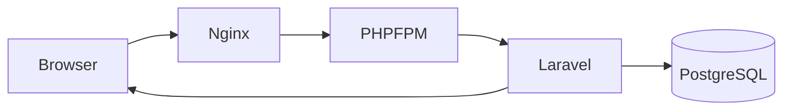
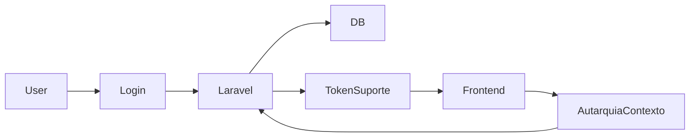
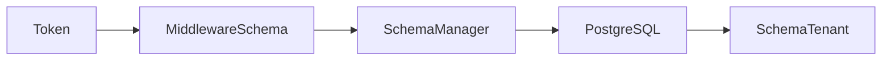

# Fluxos Atualizados para Laravel Sail

Este documento atualiza os fluxos (diagramação) para ambiente containerizado.

---

# 🔐 Fluxo de Autenticação (Sail)

---

# 🛠 Fluxo de Modo Suporte

---

# 🏛 Fluxo Multi-Tenant

