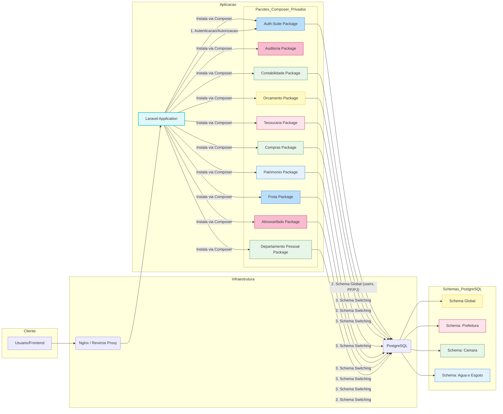

# Análise Crítica: Arquitetura Monólito Modular (Laravel Modular Feature) - Revisada

## 1. Análise da Separação de Módulos em Repositórios Distintos

Sua preocupação sobre o isolamento de código e a independência de atualização é **totalmente pertinente** e um ponto fraco do Monólito Modular tradicional.

Embora o *Laravel Modular Feature* garanta a separação lógica dentro do código, ele não garante o **isolamento de versionamento** e **independência de repositório**, o que é crucial para evitar que uma mudança em um módulo afete inadvertidamente outro.

### 1.1. Solução Proposta: Monólito com Pacotes Privados (Composer)

A melhor maneira de obter o isolamento de repositório e versionamento, mantendo o *deploy* simples do monólito, é transformar cada módulo em um **Pacote Composer Privado**.

Esta abordagem é conhecida como **Monólito com Pacotes Internos** e é a evolução mais limpa do Monólito Modular, atendendo à sua necessidade de ter repositórios separados para cada módulo de negócio.

| Módulo | Repositório | Versionamento |
| :--- | :--- | :--- |
| **Auth-Suite** | `sh3/auth-suite-package` | Independente (`v1.0.0`) |
| **Contabilidade** | `sh3/contabilidade-package` | Independente (`v0.5.0`) |
| **Tesouraria** | `sh3/tesouraria-package` | Independente (`v0.1.0`) |
| **Aplicação Principal** | `sh3/app-monolito` | Depende dos pacotes |

### 2.2. Vantagens

1.  **Isolamento de Versionamento:** Uma correção no `auth-suite-package` pode ser lançada como `v1.0.1` sem afetar o versionamento do `contabilidade-package`.
2.  **Deploy Simples:** O projeto principal (`sh3/app-monolito`) continua sendo um único *deploy* (um único contêiner Docker). O Composer apenas baixa as dependências (os pacotes) antes do *deploy*.
3.  **Reuso Genuíno:** O `auth-suite-package` pode ser facilmente reutilizado em qualquer outro projeto Laravel da empresa.
4.  **Clareza de Dependência:** O `composer.json` do projeto principal lista explicitamente quais módulos estão sendo usados e em qual versão.

---

## 3. Diagrama de Arquitetura (Monólito com Pacotes Internos)

O diagrama a seguir representa a arquitetura revisada, onde a aplicação principal é um monólito que consome pacotes Composer privados, cada um em seu próprio repositório.

---

## 4. Próximos Passos (Ajustados)

O plano de ação anterior (Fase 1) deve ser ajustado para a criação de pacotes Composer privados:

| Tarefa Original | Ajuste para Monólito com Pacotes Internos |
| :--- | :--- |
| **1. Refatoração do CORE Service** | **Criar um novo repositório** (`sh3/auth-suite-package`) e mover toda a lógica do Auth/Core para este pacote. |
| **2. Schema Switching** | A lógica de *Schema Switching* deve ser implementada no **Pacote Core** e exposta como um *Service Provider* para o projeto principal. |
| **3. Preparação do Ambiente Docker** | **Simplificação Máxima.** O `docker-compose.yaml` terá apenas 2 serviços: `app` (o Monólito Modular) e `db` (PostgreSQL). |

**Recomendação:** Adote a arquitetura de **Monólito com Pacotes Internos** e ajuste o plano da Fase 1 para criar o `auth-suite-package` em um repositório separado.
