# Diagramas de Fluxo - Auth Suite

Este documento contém os principais diagramas de fluxo do sistema Auth Suite, ilustrando processos de autenticação, modo suporte e estrutura de dados.

## Índice

- [Fluxo de Autenticação](#fluxo-de-autenticação)
- [Fluxo de Modo Suporte](#fluxo-de-modo-suporte)
- [Troca de Autarquia](#troca-de-autarquia)
- [Refresh Token Automático](#refresh-token-automático)
- [Estrutura de Dados](#estrutura-de-dados)
  - [Relacionamentos de Autarquias](#relacionamentos-de-autarquias)
  - [Permissões e Módulos](#permissões-e-módulos)

---

## Fluxo de Autenticação

### Login Completo

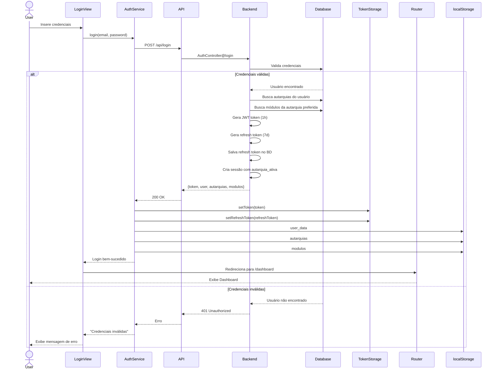

### Verificação de Autenticação

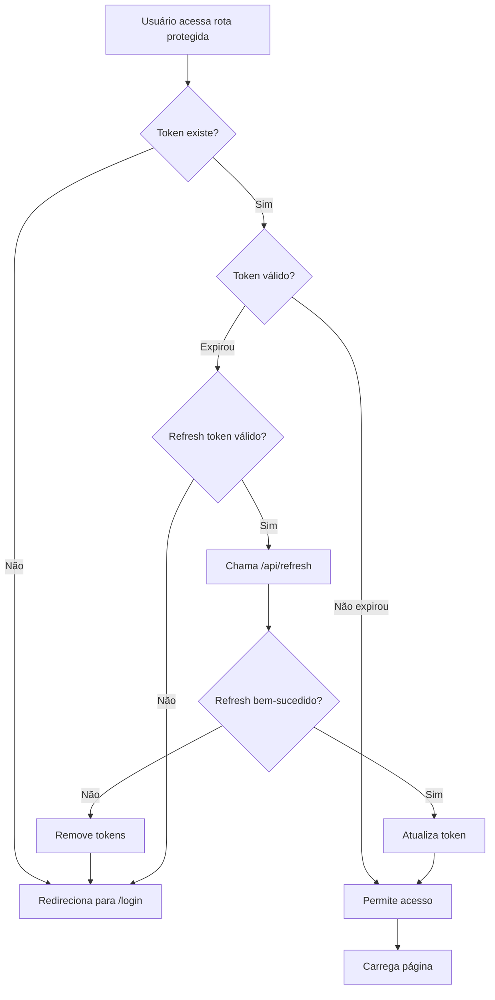

---

## Fluxo de Modo Suporte

### Assumir Contexto de Autarquia

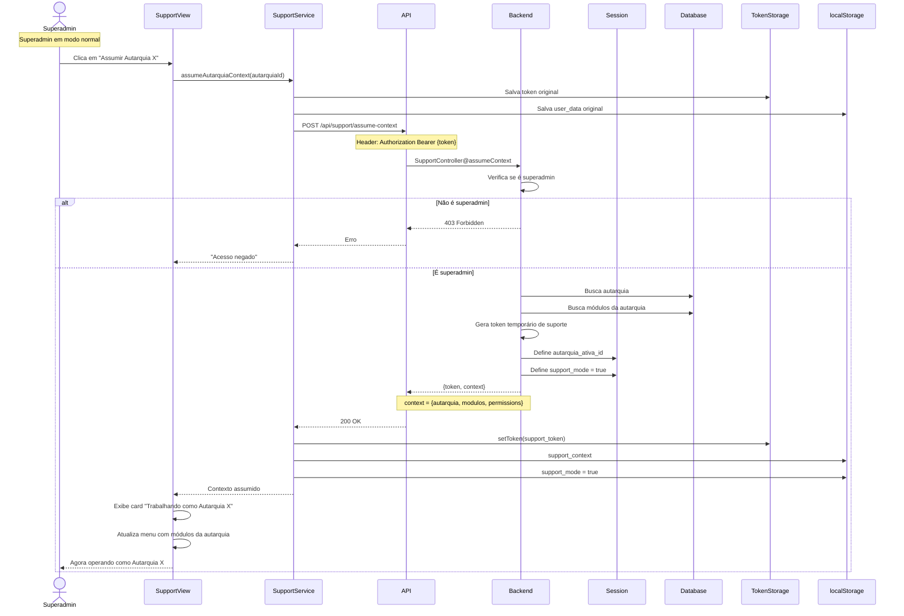

### Sair do Modo Suporte

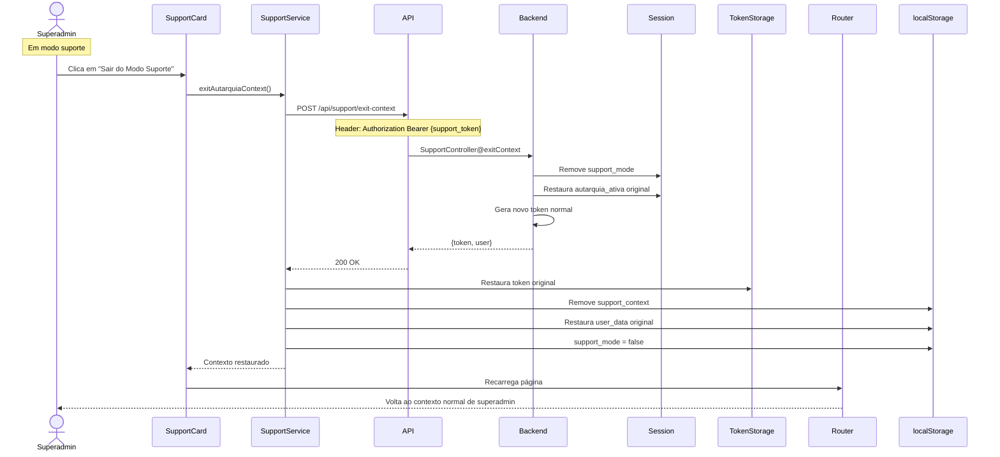

### Fluxo de Trabalho em Modo Suporte

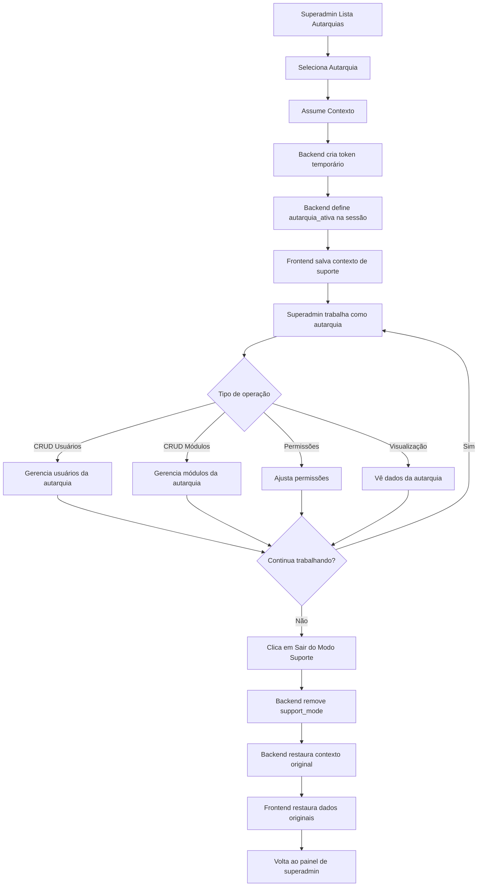

---

## Troca de Autarquia

### Usuário Normal Trocando de Autarquia

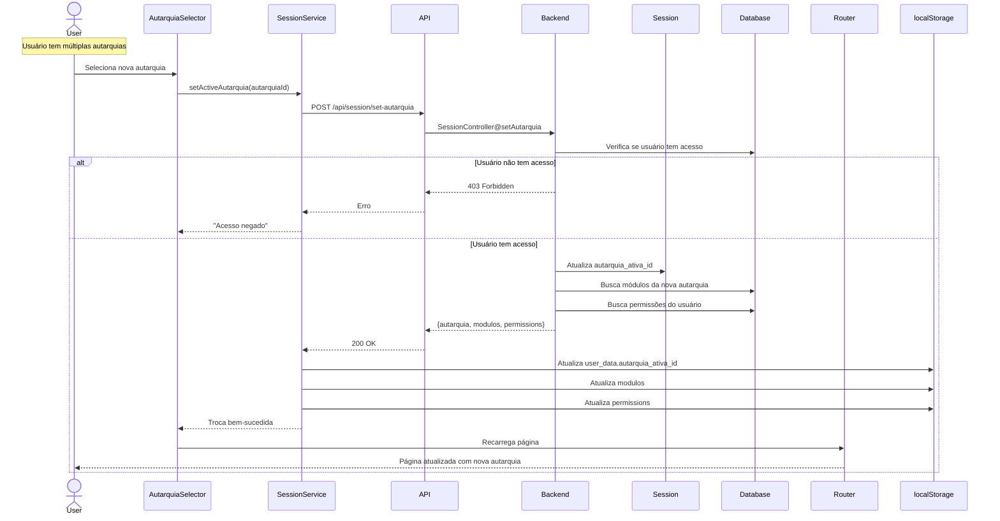

### Fluxo de Decisão: Autarquia Preferida vs Ativa

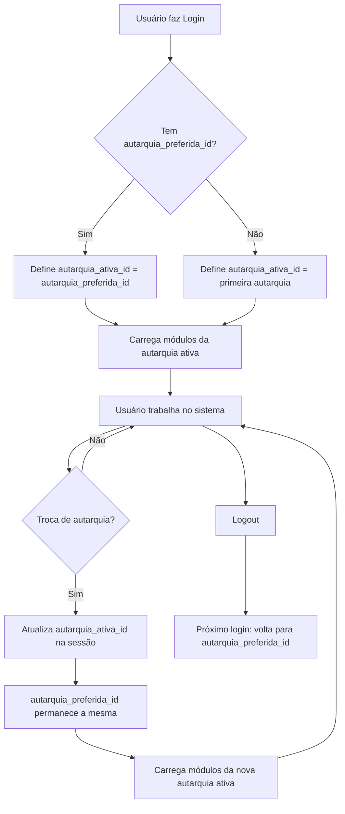

---

## Refresh Token Automático

### Auto-Refresh de Token

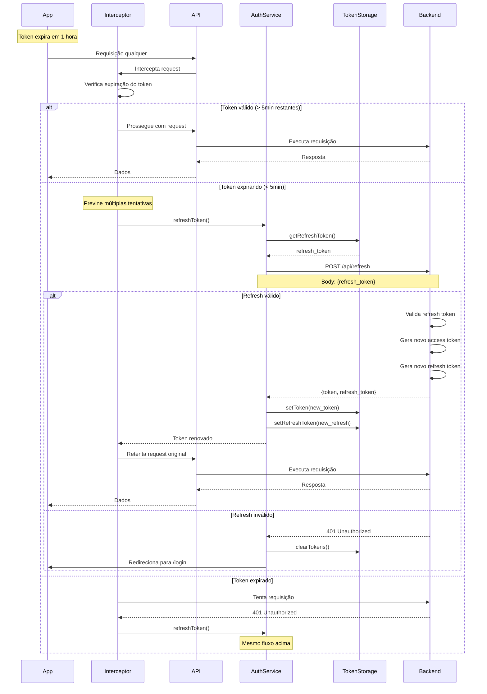

### Gerenciamento de Refresh Token

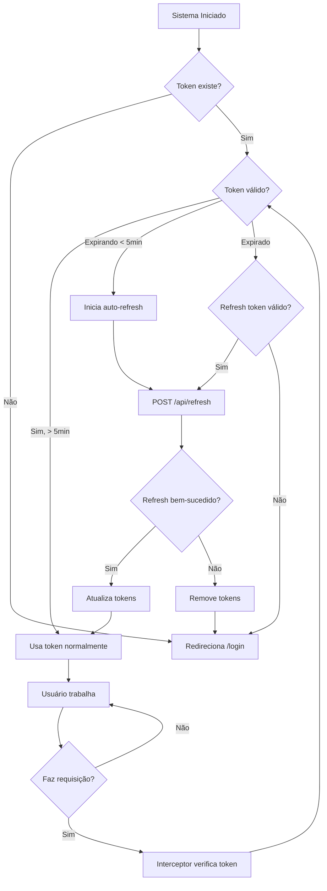

---

## Estrutura de Dados

### Relacionamentos de Autarquias

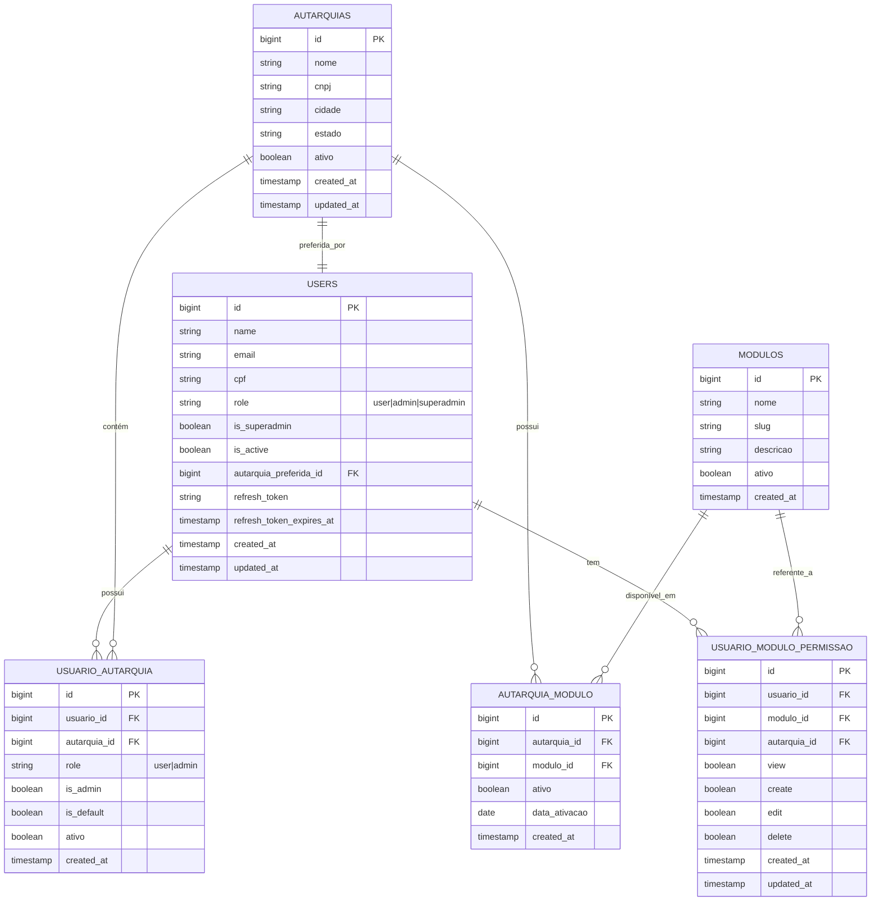

### Estrutura de Dados: Autarquia Preferida vs Ativa

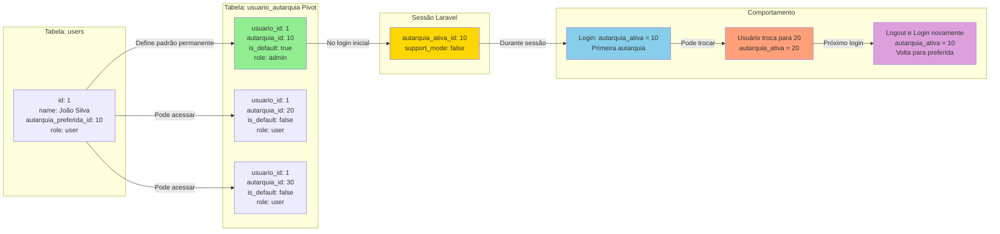

### Permissões e Módulos

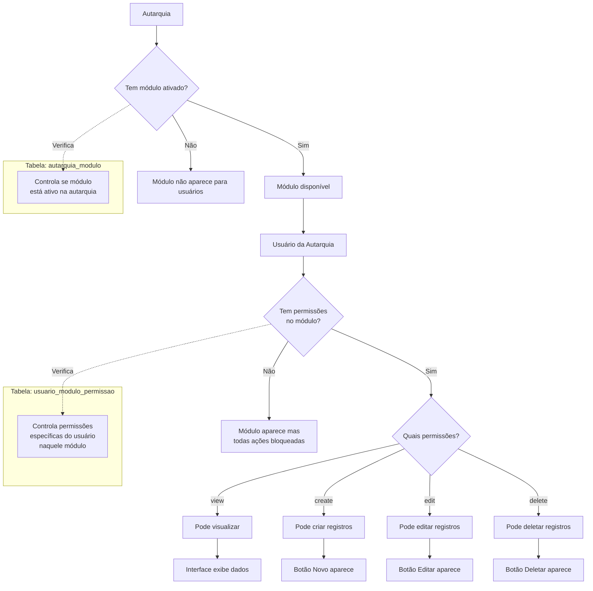

### Fluxo de Verificação de Permissões

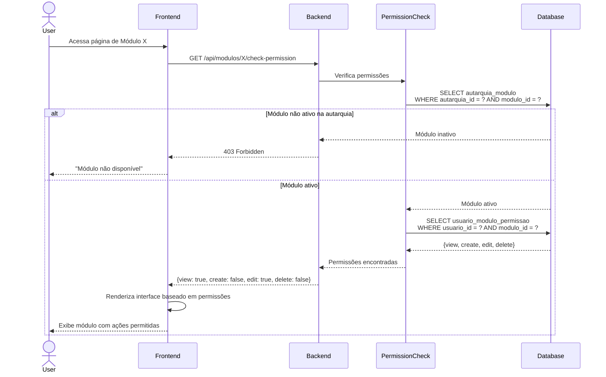

---

## Modo Suporte: Hierarquia de Acesso

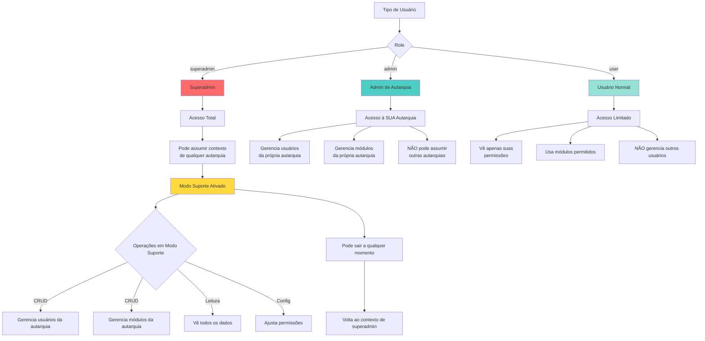

---

## Notas Técnicas

### Sobre Tokens

- **Access Token**: JWT válido por 1 hora, armazenado em `localStorage` como `auth_token`
- **Refresh Token**: String aleatória válida por 7 dias, armazenado em `localStorage` como `refresh_token`
- **Support Token**: JWT temporário gerado ao assumir contexto, substitui o access token durante modo suporte

### Sobre Autarquias

- **autarquia_preferida_id**: Campo na tabela `users`, define qual autarquia será selecionada automaticamente no login
- **autarquia_ativa_id**: Armazenada na sessão Laravel (server-side), representa a autarquia que o usuário está trabalhando no momento
- **Troca de autarquia**: Atualiza apenas `autarquia_ativa_id` na sessão, `autarquia_preferida_id` permanece inalterada

### Sobre Modo Suporte

- Apenas superadmins podem ativar modo suporte
- Token temporário é gerado com informações da autarquia assumida
- Contexto original é salvo para restauração ao sair
- Backend identifica modo suporte pela sessão `support_mode = true`

---

**Última atualização**: 2024-10-27
